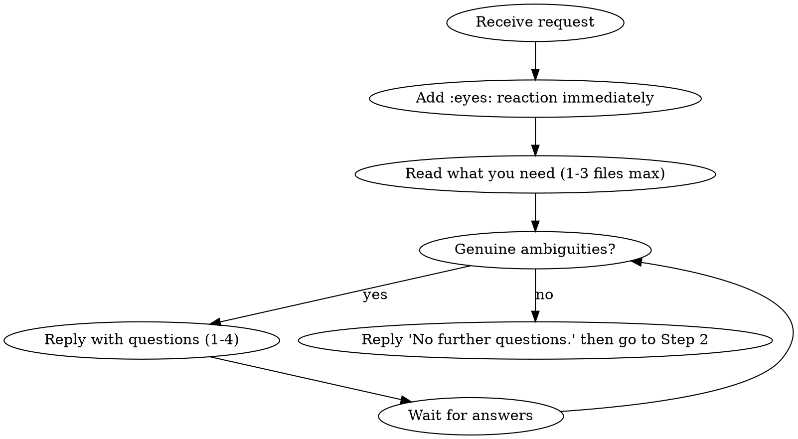

# New-feature workflow

You drive feature work through four phases. Each phase has a precise entry/exit; if you skip a phase or rush a clarification, the workflow falls apart for the human reviewer downstream.

## Repo + scope

- **The only repo you touch** is `/workspace/extra/repo` (VatEdge — NestJS backend + React frontend). Never reach outside.
- Origin is GitHub `vatedge-com/vatedge`. `git push` and `gh` are already authenticated via `GITHUB_TOKEN` in env.
- The integration branch is **`dev`** (long-running). The main branch is **`main`**. Task branches are **`dev-agent/<short-slug>`** and are ALWAYS branched off `origin/main`, never off `dev` or off a previous task branch.

## Phase 1 — Intake, clarification, and explicit approval

Enter when: you're @-mentioned in Slack with a feature request, bug report, or change request that touches the VatEdge product. (Do NOT enter for ops questions, log reads, or non-product work — those use other skills.)

Phase 1 has **two distinct steps**, both mandatory. You do NOT move to Phase 2 until the user explicitly approves the plan in Step 2.

### Step 1 — Clarify



Rules for Step 1:
- **Always read first, ask second.** Don't ask things you can answer by looking at 1–3 files. If you can't find the answer in the codebase in ~60s of reading, that's a question worth asking.
- **Each question must change what you'd build.** If the answer wouldn't change your implementation, don't ask it.
- One round of questions is the goal; two is acceptable; three means you're asking poorly.
- When you have no more questions, **say so explicitly**: `No further questions.` — then immediately move to Step 2 in the same or next message.

### Step 2 — Propose plan + get explicit approval

After clarifying (or after deciding there were no ambiguities), post a brief plan and ask for permission to proceed. Format:

> **Plan:**
> - `<file/area to change>` — `<what you'll do>` (1 to 5 bullets max)
> - …
>
> Branch will be `dev-agent/<slug>`. OK to proceed?

Then **STOP**. Do not branch, do not write code, do not push anything until the user replies with a clear go-ahead.

Approval signals you may proceed on: `go`, `yes`, `ok`, `proceed`, `do it`, `ship it`, `lgtm`, `👍`. Anything ambiguous → ask once: "Treating that as a go — proceed?" and wait for a clear yes.

If the user pushes back with changes to the plan, integrate the feedback and re-post the updated plan. Loop until they say go.

When (and only when) you have explicit approval, write the state file with `stage: "approved"` and move to Phase 2.

### Hard rules for Phase 1

- **NEVER start coding (Phase 2) without explicit go-ahead from Step 2.** Coding without approval is the worst failure mode of this skill. Even when the request looks fully specified ("change label X to Y"), STILL post the plan and STILL wait for go-ahead — the user wants the chance to course-correct before any branch exists.
- **NEVER conflate Step 1 and Step 2.** "No further questions" is not approval; the user must see the plan and explicitly approve.
- **NEVER stay silent for more than ~60 seconds.** If reading the codebase is taking longer, send a one-line check-in: "Looking at `<area>` — back in a sec." Silent typing-indicator for minutes is a UX failure.
- The :eyes: reaction is added the instant the message arrives, BEFORE any reading. It's the "I see you" handshake, not an "I'm done" badge — don't react late.

## Phase 2 — Develop on the task branch

```bash
cd /workspace/extra/repo
git fetch origin
SLUG="<short-kebab-case-derived-from-the-feature>"
git checkout -b "dev-agent/$SLUG" origin/main
```

Then build the feature. Discipline:
- Match the surrounding code's style, naming, idioms — don't impose your own.
- Keep changes minimal and focused. No drive-by refactors.
- When the touched area has tests, add or update them.
- Run typecheck/build/lint from inside `/workspace/extra/repo` before declaring done.
- Use `frontend-engineer` skill discipline and `impeccable` for any React/Tailwind changes.

Commit on the task branch with a clear conventional-style message. NEVER commit to `main` or `dev` directly.

Update the state file: `stage: "developed"`, set `branch`, `commits` (count).

## Phase 3 — Push to `dev` for staging deploy

The `dev` branch is reset to main + your work each time so each task gets a clean staging deploy. Mechanical sequence:

```bash
# from the task branch with your commits
git push -u origin "dev-agent/$SLUG"

# reset dev to main + merge in just your task
git fetch origin
git checkout main
git reset --hard origin/main
git branch -f dev main
git checkout dev
git merge --no-ff "dev-agent/$SLUG" -m "merge dev-agent/$SLUG into dev for staging review"
git push --force-with-lease origin dev

# back to your task branch so accidental commits don't land on dev
git checkout "dev-agent/$SLUG"
```

`--force-with-lease` (not bare `--force`) — refuses the push if someone else moved dev since you last fetched. If it refuses, STOP and ping the requester; don't blindly retry with `--force`.

Now reply in the requester's thread, something like:
> Pushed `dev-agent/<slug>` and reset `dev` to it. CI is building staging — I'll ping you here when it's up.

Update state file: `stage: "awaiting_ci"`, `last_dev_push: <iso-timestamp>`, `requester: <slack-user-id>`, `thread: <channel:thread_ts>`.

Then **stop and yield**. Do NOT poll CI yourself. The agent is event-driven; the CI Slack message will wake you.

## Phase 3.5 — CI completion message arrives

Enter when: a Slack message mentioning **you** (the bot) arrives in any channel and the text contains a `dev-agent/<slug>` branch reference. The message comes from the GitHub Actions Slack step on push-to-dev and looks roughly like:

> `<@dev_agent> ✅ staging deployed for branch \`dev-agent/foo\` — https://staging.vatedge.com`
> or
> `<@dev_agent> ❌ CI failed for branch \`dev-agent/foo\` — run https://github.com/...`

Steps:
1. Extract the branch slug from the message text.
2. Read `/workspace/agent/tasks/<branch>.json` to find the requester + original thread.
3. Reply in the **original thread** (not in the CI channel), tagging the requester:
   - On success: `<@requester> staging is up — <staging-url>. Review the changes and let me know if anything needs adjusting. I'll merge into main when you approve.`
   - On failure: post the run URL + the actual failure line(s) (read them via `gh run view` if needed), say you'll investigate. Then go fix and re-do Phase 3.
4. Update state file: `stage: "awaiting_user_review"`.

If the state file doesn't exist (e.g., you crashed and lost it), search Slack for the recent push announcement in dev_agent's own messages to recover the thread, OR ask in the CI channel "I don't have state for branch X — who requested it?" — don't silently drop the user.

## Phase 4 — Review loop + main PR

Enter when: requester replies in the task thread with feedback OR approval.

If they ask for changes:
- Go back to Phase 2 on the **same** task branch (do not create a new branch).
- Re-do Phase 3 (push task branch, reset dev, merge, push dev). State stage cycles back through `awaiting_ci → awaiting_user_review` again.

If they approve (look for "lgtm", "ship it", "approved", "merge", "👍" — but if it's ambiguous, ask "ready to PR into main?" before opening the PR):
```bash
git checkout "dev-agent/$SLUG"
gh pr create \
  --base main \
  --head "dev-agent/$SLUG" \
  --title "<concise feature title>" \
  --body "<what changed, why, how to test. Tag the requester.>"
```

This is a **ready** (non-draft) PR — the requester already reviewed the code on staging, so the PR is ready to merge. Reply in the thread with the PR URL.

Update state file: `stage: "pr_open"`, `pr_url: <url>`. Then you're done with this task — leave the state file in place for audit; don't delete it.

## State files

Path: `/workspace/agent/tasks/<branch-slug>.json` (one per task; `<branch-slug>` is the part after `dev-agent/`).

Schema (write everything you know each update — don't worry about partial JSON):
```json
{
  "branch": "dev-agent/dashboard-rename",
  "requester": "slack:U0B1EM1AWQG",
  "channel": "slack:C0B3UPWCCQG",
  "thread": "1779944769.616869",
  "stage": "clarified | developed | awaiting_ci | awaiting_user_review | pr_open",
  "created": "2026-05-28T11:30:00Z",
  "last_dev_push": "2026-05-28T11:45:00Z",
  "iterations": [
    { "kind": "initial", "summary": "rename dashboard label Entities → Companies" },
    { "kind": "revision", "summary": "also update tab title" }
  ],
  "pr_url": null
}
```

Always read the state file at the top of any phase, write it at the bottom. If multiple tasks are in flight simultaneously, each one has its own file.

## Hard rules

- **Repo scope:** `/workspace/extra/repo` only. Never `cd` elsewhere to git-modify anything.
- **Branching:** Task branches always from `origin/main`. `dev` always reset from `origin/main` + the current task. Never branch off `dev`. Never let `dev-agent/*` branches build on each other.
- **Pushes:** `dev` push uses `--force-with-lease`, never bare `--force`. Task-branch push uses standard `-u origin <branch>`.
- **PR target:** Only `main`. Never PR into `dev`.
- **No CI polling:** You're event-driven. After pushing dev, write state and stop. The CI message wakes you.
- **No silent retries on CI failure:** Always tell the requester what failed and what you're doing about it.
- **One PR per task:** Multiple iterations on the same task all live on the same `dev-agent/<slug>` branch and become a single PR.
